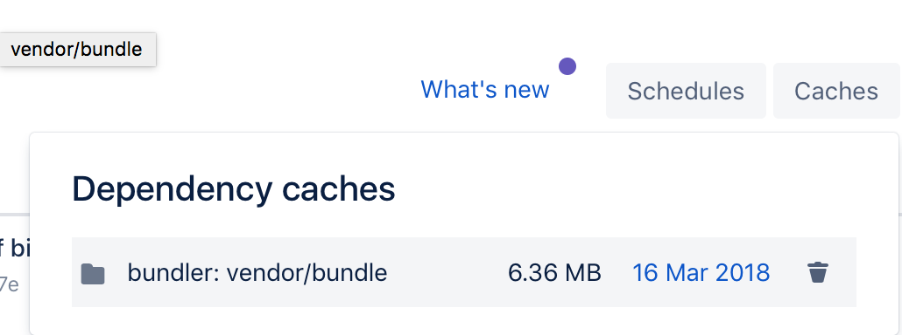

As long as I’ve read articles on medium, a lot of stories have been about ‘the cloud’. But I still don’t see a lot of documentation of people moving the most popular usage of the internet to the cloud: Websites.

A couple of years ago I started building a website with a small team in our spare time. We wanted to make sure non-technical people would be able to do most of the editing of the website, so a CMS was a must-have. We thought we’d save ourselves some time by taking the beaten path: Wordpress with a purchased theme. We bought a theme that looked nice and started customizing it. When I opened the theme in my code editor, I stared at a programmers worst nightmare: a full plate of spaghetti code.

We stuck with it, spend months wrestling with the code to make the website do what we want it to do. Some parts were rebuilt, but most of the time we adapted existing code. We got it working, but it cost us a lot of time.

")

The site has been running for a few years without any major problems, but still I have a few annoyances. For instance, adding new features still takes a lot of time (mostly searching through 100s of css classes). Also, our site-maintainers often copy-paste text from Microsoft Word into Wordpress, and upload pictures of multiple megabytes. This gives us all kinds of styling and performance problems. Maybe websites are better maintained by technical people. I figured the time had come to try and make the site better maintainable. Even if that meant that it had to be updated by programmers.

I had been following developments in static websites for a while, especially jekyll. The idea of going back to basics and reducing a website to a bunch of files again sounded really good: security, caching, configuration, hosting everything becomes a lot simpler. Content management? Git seems perfect for that. The only thing missing is a wysiwyg editor, but who needs that anyway right? The site i am talking about is mostly text, images and links, and those few dynamic features can be easily solved using either a SaaS webservice or some cloud-based service like amazon lambda.

I decided to take 1 week to try and rebuild the entire site in flat html. I actually got that done in about 1 saturday. Then I thought: let’s go all the way and convert this thing to a jekyll website. I made a list of all challenges that i would have to solve in order to do that:

* Where do I store content?
* How do I generate the site from the content?
* Where can I host the site?
* I have a contact form. How do I handle these form submissions?
* How do I make it easy to make a quick change to the website?
* How do I make it easy to run a local development * instance of the website?
* I have weekly blog items that link to weekly youtube videos and podcast audio. In the old site, this link is automatically made by an hourly php cron job. Can I still do this?
* Can we do all of that for little or no monthly cost?

## Git
For static websites, it really makes sense to use git. It saves you all the trouble of ftp, version management backup etc. For static websites, [Github](http://github.com/) has great feature that builds and hosts your website on Github servers for free. It does have the added requirement that you open-source your code.

In the end I choose to use [Bitbucket](http://bitbucket.org/) because they offer private repositories for free. The ‘pipelines’ feature also looked promising to run jekyll for automated deployment.

## Hosting
I looked into a couple of static website hosting services like [CloudCannon](http://cloudcannon.com/) and [SiteLeaf](http://siteleaf.com/) which have really cool CMS interfaces as well as a git-backends and added hosting, but they’re quite expensive for a small website.

In the end I chose to use Google Firebase to host the website. Mainly because our organization already uses Google products, and because I really like the simplicity of firebase compared to the enormous complexity that is Amazon Webservices. If you don’t know what firebase is, check out [my article on Firebase](https://medium.com/@richmans/firebase-a-one-stop-shop-for-your-backend-needs-63fab5d1c265). Firebase includes a couple of services, I’ll mostly be using hosting and functions.

Firebase Hosting lets you upload your static website using a command line program. It is hosted on a google CDN. The dashboard interface is really basic: you can roll back a deployment. Thats it. You can’t manipulate individual files or have statistics or anything. It only does hosting!

Firebase functions lets you upload and run code on Google servers without having a dedicated server. You basically pay per invocation. It’s similar to (although less powerful than) Amazon Lambda.

Forms
You can’t process form submissions in a static site. So you need some kind of server-side code. I chose to use Google Functions for this. The form submits to a function, which makes a call to slack (we were already using slack to monitor site events). You can find many guides online on how to do this.

## Quick edits
When you log in to the bitbucket website, there is a feature where you can open up a file and edit it right from the browser. When you’re done it lets you create a commit and boom! Done. It even has syntax highlighting! This is perfect for when you are on the go and you have to make a quick edit.

")

## Local development
On my mac, [jekyll is really easy to install](https://jekyllrb.com/docs/installation/). My team-mates have windows laptops, which are a lot harder to setup with ruby and all the dependencies. I was wondering if there is an easy way to get jekyll running on their machines with the site content loaded. There is: it’s called docker. The latest version of docker includes Kitematic, which is a very user-friendly gui. It has a ‘store’ feature which lets you search docker hub for images and spin them up with one click.

")
Then, Kitematic lets you customize port numbers and volumes. So installing the development environment becomes easy as:
* Installing docker
* Starting my custom docker image from the store
* Setting the /site directory mount to where you have the git repo checked out on your computer.

Boom! You’re running the site on localhost. No databases to install or configure, no configuration files to edit, 
no commands to type, nothing.

")

Added feature: If we decide to add dependencies later, I can just update the docker image. I’m currently using [my own jekyll-serve image](https://hub.docker.com/r/richmans/jekyll-serve/).

## Site generation
We need some kind of process that is triggered by a git commit which runs Jekyll to generate the html, and then uses the Firebase CLI to push the new site to google. I’ve found that Bitbucket pipelines works perfectly for this.

To configure it, you simply add a bitbucket-pipelines.yml file to your project. It pulls a Docker image of your choice, pulls in the git repo and then executes your commands.

There is one major limitation: the free Bitbucket plan only gives you 50 build minutes. It seems that the time you spend setting up also counts. My build takes somewhere between 30 and 60 seconds. So that would allow me to deploy about 2 times per day. That’s not a lot but I think it will do.

When you setup your environment, you use a standard Docker image. For Jekyll, we need ruby. Then, it needs to install libraries. This takes a long time, which means precious build minutes! Luckily pipelines can cache the libraries for you speeding up the process. When I enabled this, my build time went from 1 minute to 30 seconds. I got this working by installing the gems with the — path flag. This ensures that the gems are installed in the project folder under /vendor. Then, you tell bitbucket to cache that folder.

```YAML
image: radul/jekyll-firebase

pipelines:
  default:
    - step:
        caches:
          - bundler
        script: 
          - bundle install --path vendor/bundle
          - bundle exec jekyll build
          - firebase deploy --token "$FIREBASE_TOKEN" --project myproject --only=hosting
definitions:
  caches:
    bundler: vendor/bundle
```

There’s one more gotcha: Bitbucket only deletes the cache once a week. If you change your bundle, or like me, you started with an empty bundle and you’re wondering why the cache doesn’t work, here’s why:



You click ‘caches’ in the top left corner of the pipelines screen, **and then hover over the cache**. The recycle bin icon will appear! Click that, rebuild and Bitbucket will re-populate the cache.

## The jawbreaker: Automate content updates
Up until this point, I was surprised at every step by how simple and easy I could achieve everything. I had a nice clean codebase, very easy to maintain and hosted cheaply. I had a couple of interactive features that i had solved using Firebase Functions that took only a couple of lines of code.

The only TODO left was to make sure that our videos and podcast items were automatically linked to the correct blog post. In the previous site, I had a php script that simply put the links into the Wordpress database. For this site: things get a little more complicated because:

* I don’t want a server running constantly
* Every blog item is a separate file with metadata encoded as YAML. To add something you have to read the file, parse the yaml, add the data, then dump it back to a string and write the file.
* Everything is in Git, and the site can only be updated by doing a git commit.

I wanted to solve this using Firebase Functions, mostly because I was already using it for the interactive website features. Because these environment can be reset every call, we’ll need to do a clone of the git repo every time the function runs. That sounds like a lot of work, but it’s not so bad because this is not a Wordpress site. It has a LOT less code, all the pictures have been downsized and compressed and it only includes scripts, fonts and stylesheets that are actually used. The full repository weighs only 6 megabytes. Also, git is very efficient in downloading files. I found that you can [prevent git from downloading all the history](https://git-scm.com/docs/git-clone#git-clone---depthltdepthgt). After doing that, I could do a git clone in a little over a second.

After cloning, the function can download the RSS files that contain the information that I want to add to the blogs, parse all the blog entries, check if any of them can be updated, write back the updated blog entries, create a commit and push that back to the repository.

Doing all that cost me 200 lines of NodeJS code and about 6 hours. Pretty tough for something that took me maybe 50 lines of code and 2 hours to program in Wordpress. So this is definately something that is harder to do in a jekyll website compared to a Wordpress website.

## In short
I summed up a list of questions, here are the answers:
Content/code storage: bitbucket
* **Site generation**: bitbucket pipelines
* **Site hosting**: Google Firebase Hosting
* **Form submissions**: Google Firebase Functions, Slack
* **Quick edits**: Bitbucket webinterface
* **Local development**: Jekyll docker instance
* **Weekly media links**: Google Firebase Functions
* **Cost**: Bitbucket is free, Estimated cost for Google services is less than a dollar per month. UPDATE: [Google added a free tier to the pay-as-you-go plan](https://firebase.googleblog.com/2018/03/adding-free-usage-to-blaze-pricing-plan.html), which means our website will probably run for free.

## Profit
So there you have it: a site that is secure, fast, cheap and easy to maintain. The community around Jekyll and static websites in general is growing fast. New solutions are popping up all the time. I was amazed by how easy it was convert 90% of the functionality to the static website. However, implementing scripts that add or update content automatically is a bit harder. It would be nice if there were frameworks or libraries to do things like this, but I haven’t found any… yet! I did find [this NodeJS library](https://www.npmjs.com/package/gray-matter) that can parse and dump jekyll frontmatter.

Going static should allow us to develop new features way faster, and allow us to experiment more with the user experience. Google Firebase offers enough features for even more complicated interactive features.
I haven’t found any good free gui-based interfaces to edit jekyll websites. There are a couple of projects that try, but in my opinion they are not user friendly enough to support non-technical editors. If you do need a nice interface to edit articles and pages on your website, you should definitely take a look at [CloudCannon](http://cloudcannon.com/).

This item was not sponsored by CloudCannon, Google, Bitbucket or anyone else.