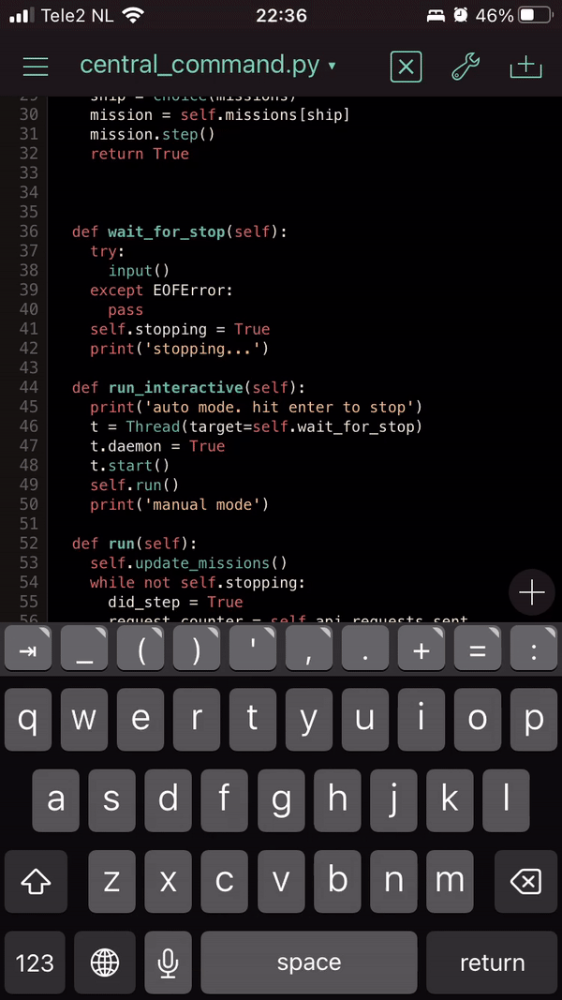

I wrote [earlier](https://clearsky.dev/blog/iphone-devops/) about my dream of developing "single-handedly" on an iPhone. That dream has not gone away. In fact, the arrival of another baby in my house has again led to increased iPhone screentime and decreased laptop-screentime. So consider this an update of my iPhone DevOps adventure.

## But why would you want this?
I've been a developer since I was a kid. Writing code is what I love to do. Recently, I became a dad. This new task involves a lot of walking and sitting with your child while it either sleeps or cries. Usually I need only one hand to perform these dad-duties. The other hand and also my brain are free to... write code? My child got a bit older in the mean time but still I find that I rarely have time to sit down behind a laptop, yet have enough time to spend on my phone. So what if instead of trying to scroll through the mountain of garbage called facebook, I use that time to code? This is basically my main reason for wanting to code on the phone.

In the beginning, I was mostly developing scripts (both bash and python) that managed my docker environment. The scripts are pretty small and have limited features. I found that using a good ssh client combined with tmux and vi, this was (sort of) doable. 

## New project, new workflow
This year, i discovered [spacetraders](https://spacetraders.io). It's a kind of game where you command ships using a REST api. I decided that this was a worthy project for my next mobile DevOps adventure. So i got to work using my language of choice: python. However, I quickly discovered that my workflow was not working as well for this project. Mainly:

* This project needed more than 1 module, so I was often switching between files in my editor.
* The files were longer, so I was scrolling much more. This is very slow in vi

I needed a new workflow for this project...

## What didn't work: VSCode
I'm a big fan of [VSCode](https://code.visualstudio.com/). It's not the fastest editor but it's very flexible and has a lot of good plugins. I already knew that you could [host it as a webapp and run it in the browser](https://github.com/coder/code-server). What if I had my complete Dev environment in a docker container on my server, and I could just resume my work on my phone where I left off on my laptop? That would be AMAZING!

So I set it up. It was very easy to setup and to get it working. You can even add the site as an icon on your iphone so it kind of feels like a regular 'app'. With some tweaking, the fonts and icons were kind of ok. That's when I found the problem, a real showstopper without a workaround.

> you can't select anything

Wait what? So on other apps or even webapps on my iphone, i long-press and then choose 'select', and then 'copy' to copy something. As with a lot of tasks in my 'mobile development workflow', it's way slower then the desktop experience but it's what there is, and you learn to live with that. But when I long-press in VSCode I get some kind of menu. No way of selecting text. I looked for plugins or other solutions but there is just no way. Desperate, I even tried some [wrapper app](https://apps.apple.com/nl/app/ucow-ultimate-code-wrapper/id1551344923?l=en) **(do not buy this app)**. There is just no way to get this working. Which is so weird because the functionality of selecting text is already in the browser! So VSCode is disabling that somehow. Of course VSCode was never designed to be used on a touch screen. Still, this is crazy. I hope someone fixes this.

## The next best thing: pythonista
Pythonista is an app that lets you edit and run python scripts on the iphone. It seems to focus mostly on game or ui development, but i've found it usable for cli apps as well. Most importantly, it does a couple of things very smoothly: scrolling, switching between files and the running script output. Observe!

But, maybe much more importantly observe the following shocking innovation!

**Eat that, VSCode!**

As with most things that run on an iPhone, the UI is pretty great. But it's not all good news:

* The code runs locally in the app, which means it **stops when you leave the app**. Not really usable for longer running processes. I use pythonista only to do quick tests. To do a longer test I have to commit and deploy the code to my server.
* speaking of committing, it had **no git support** I work around that using [Polygit](https://apps.apple.com/nl/app/polygit-git-client/id1508942822?l=en) and adding the polygit dir to pythonista. This works fine.
* It packs a bunch of libraries by default, but it has **no way of installing new packages or upgrading existing ones**. For instance, i found that the yaml lib is broken. This is solved in a newer version, but I have no way to update it. I worked around this by using json...
* The 'play' button **executes the file that is currently open** Larger projects usually have a 'main' file that you want to execute. Executing some submodule is useless. So when i edit a file and I want to test it, I have to go back to the main.py file and then press play. This is cumbersome. One partial workaround is to have main.py open in a separate tab
* There is **no way to pass commandline arguments** to a script. I work around this by making all options available as commands within my script.
* The terminal is **not a real terminal**. You can use `input()` and `print()` but don't expect anything fancy like arrow keys or colors to work
* It **works only for python**.I would love to work more with other languages such as rust, but I'd need a different solution for that.

## Conclusion: it works...for patient people
Coding on an iPhone is no joke. It takes longer and is more error-prone than a desktop experience. But if you have no other choice, and you have a large amount of patience, you can actually program spaceships from an iPhone. And to me, that's pretty neat!
