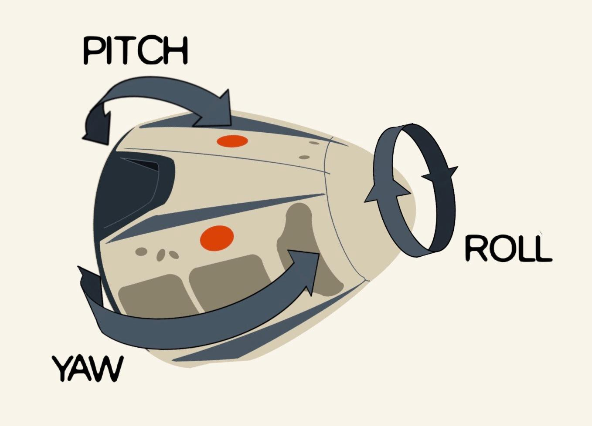
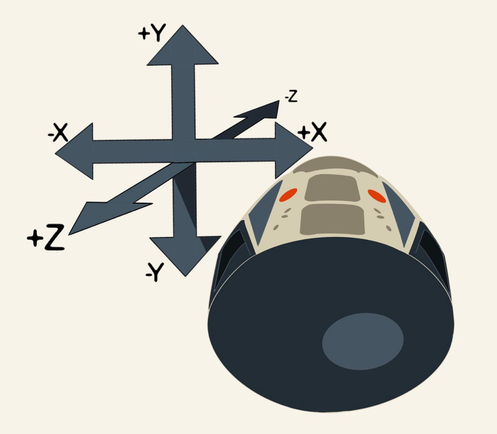
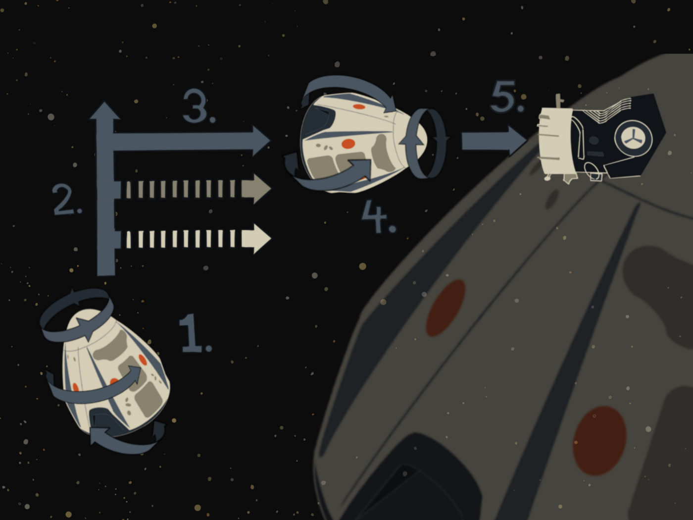

From a young age, I have always been fascinated by space. Most of all, the [Apollo program](https://en.wikipedia.org/wiki/Apollo_program) has always been a source of inspiration for me. But unlike most kids, I would not picture myself in a spacesuit. I would picture myself in mission control. I was always more interested in the technology. Fixing an electrical problem in a spacecraft hundreds of thousands of kilometers a way by understanding everything about it and pushing the right buttons.

Although I became a developer and never did anything related to space professionally, the interest remained. So when SpaceX offered an [online simulator](http://iss-sim.spacex.com/) where you have to dock the dragon spacecraft to the international spacestation, ofcourse I took a look. And not being a gamer or astronaut, ofcourse I crashed that dragon right into the ISS on the first few tries (sorry, NASA). So what does a developer do when a task is too hard? He gets his computer to do it.

Flying a spacecraft is a great task for a computer. The apollo spacecraft had an autopilot as part of its guidance computer. It was a great piece of engineering, developed at MIT. They [basically invented ‘software’ as they were going](https://www.wired.com/2015/10/margaret-hamilton-nasa-apollo/). The real SpaceX dragon capsule also has an autopilot, which has already docked it to the ISS countless times.

After having read so much about these systems, I thought it would be a fun challenge to write an autopilot for this simulator. Let's dive right in!

## Space 101
Let’s start with some terminology. Flying a spacecraft is a bit different from driving a car. Instead of only turning left and right, you can **turn in 6 directions**.



But that is just **rotation**. We won’t get any closer to the ISS by rotating around our own axes. For that, we need **translation**. The spacecraft has small rockets pointing different directions to rotate. These are also used to fly in any direction without needing to rotate in the direction it wants to fly in. In other words: you don’t have to fly in the direction that the nose of the spacecraft is pointing.



All these things can be done independently. So you can rotate without moving, and move without rotating. You can also do it at the same time, although that can be more challenging.

One other major difference between space and life on earth: **when you start moving, you’ll keep on moving**. So when i press the ‘yaw right’ button, the spacecraft will start rotating right, and keep going until i press the ‘yaw left’ button to neutralize the movement.

## Setup
First challenge: how do we write code that interacts with SpaceX’s simulator, which is essentially a website? I chose a solution that is simple and easy to setup: a browser plugin that lets me execute javascript code inside websites. I’m using [tampermonkey](https://chrome.google.com/webstore/detail/tampermonkey/dhdgffkkebhmkfjojejmpbldmpobfkfo?hl=en) which works in chrome. Other browsers have similar plugins.

## Systematic docking.
Now that we have a grip on the simulator, let’s think about the different steps that are needed to dock. After a couple of tries, I came to the conclusion that the easiest way is to line up in front of the port first, and then you only have to move forward! Here’s the 5 step plan to a succesful dock:



1. **Orient**: First, we want the spacecraft to point the right way (roll pitch and yaw). This makes navigating a lot easier.
2. **Translate**: Then, we want to make sure that the spacecraft is exactly in front of the docking port.
3. **Approach**: Next, we will approach the docking port. This can be done at relatively high speed, and without any course correction. I configured the hold distance to be about 20 meters.
4. **Translate**: at the hold point, we will probably have a small translation error. We need to correct those before moving on. This is the same as step 2, but with greater precision.
5. **Dock**: Lastly, we move into the docking port at a very slow speed, correcting translation while flying

## The autopilot loop
On a high level, the autopilot does 3 things over and over:
1. Gather data about the current state of the spacecraft
2. Decide where the spacecraft should go
3. Take the necessary actions to get closer to that goal.

That looks like this when you talk javascript:

```JavaScript
function fly(state) { 
  updateSensors(state)  
  actions = runProgram(state) 
  executeActions(actions)
}
```

It does these things in a loop. You would think that everything happens very fast when rockets are involved. In practice, the absence of atmosphere makes movements of spacecraft much more predictable and easier to manage. Also as I mentioned, the best way to dock is very slowly! [The spaceshuttle docking procedure ran 25 times per second](https://www.nasa.gov/mission_pages/shuttle/flyout/flyfeature_shuttlecomputers.html). My autopilot only runs once per second.

## Gather data
The simulator displays a number of measurements that will help us decide what to do. So we need to get all those values. The great thing is that these numbers are all present in html nodes (thanks, SpaceX programmers!). For instance, we can get the value of the pitch error as follows:

```JavaScript
parseFloat(document.querySelector("#pitch .error").textContent)
```

The complete list of values that I fetch from the html can be seen in `updateSensors`. All these variables are written to an object called `state` which contains all data that the autopilot uses.

## Decision time
To make the decisions, I defined 5 different “programs”. Each program is responsible for achieving a step in the 5-step plan that I described. It also detects when it has achieved its goal and activates the next program. Only 1 program runs at any time.

Discussing each program would make this post too long and boring. Lets just take a look at the first program. If you want to know more about the other programs, have a look at the code :-)

The first program is called **orient**. It deals with the 3 rotational axis: roll, pitch and yaw. Its goal is to point the spacecraft the right way. The simulator shows the “error” for each axis: the difference between the current orientation of the spacecraft and the orientation that is needed to dock.
So orient’s goal in more technical terms is: bring the pitch, yaw and roll errors to within -0.2 and +0.2.

The simulator controls have a button to put them in “precision mode”. This means the effect of pressing a button will be smaller, allowing you to make more precise corrections. The first thing the program does is check if precision mode is on, and id not, queues an action to enable it.

Next, it will determine if there are actions needed in any of the 3 axis (roll, pitch, yaw). Since the logic is the same for each axis, i do this in a for loop.

There are 4 situations that require the rotate program to take action. Lets take the roll axis as an example

1. The spacecraft is not rolling, and is angled to the left. We need to start rolling right
2. The spacecraft is rolling right, and oriented correctly. We need to stop rolling
3. The spacecraft is not rolling, and is angled to the right. We need to start rolling left
4. The spacecraft is rolling left, and is oriented correctly. We need to stop rolling

The last thing the program needs to do is to see if it has reached its goal. If all the errors are within the margin it updates the state to set the current program to “translate”

The other programs do basically the same thing. Fire some thrusters to move in the right direction, wait for the goal to be reached, fire thrusters in the opposite direction to stop moving.

## Take action
When we have decided which way to fly, we need a way to let the simulator do what we want. I implemented this by simulating a ‘click’ event on the appropriate button like so:

```JavaScript
document.getElementById(‘yaw-right-button’).click();
```

## Lets fly!
So about 300 lines of code gets us safely docked… in the simulator. An autopilot in a real spacecraft would probably have more safety features and checks. If it detects something is off, it will retreat to a safe postion. One thing that real flight computers also deal with: what happens when a thruster stops working? You can probably keep steering by using the remaining thrusters in a smart way.
So this 300 line script is not even close to a real autopilot. But it was certainly fun to create!
If you want to try it, head over to my github repo [https://github.com/richmans/autopilot](https://github.com/richmans/autopilot) and follow the installation instructions. If you have any ideas or improvements, PR’s are very welcome :-)

Thanks to Sven for the awesome illustrations!