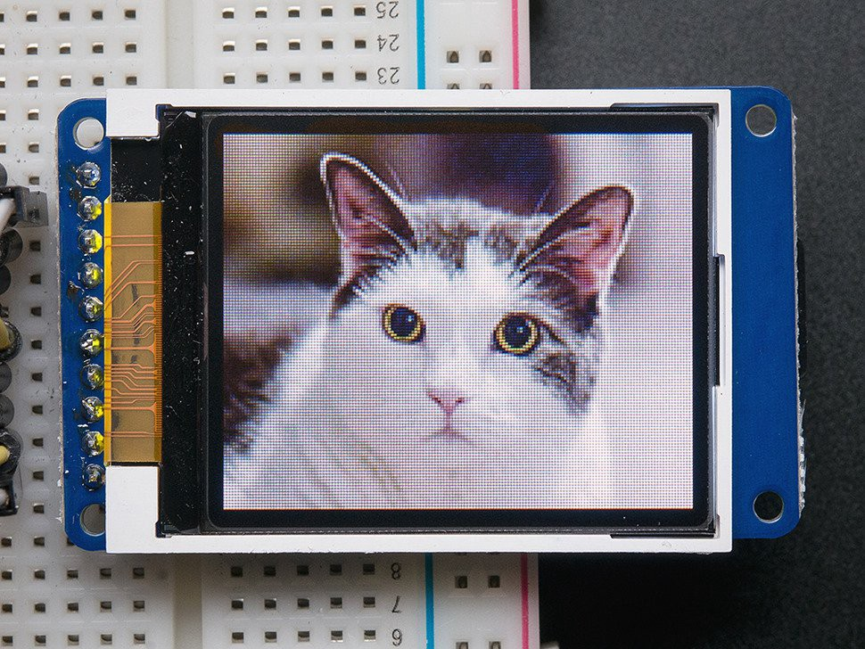
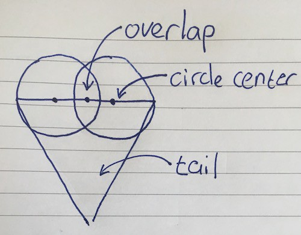
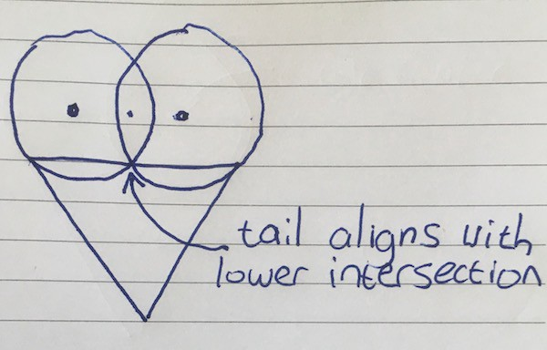

A friend of mine is getting married soon, and we wanted to do something creative as a present. We wanted to create something involving a small color screen showing motiviational marriage-related quotes. I thought it would be fun to include some animated graphics. What graphics do you include in a wedding-gift? Hearts ofcourse! I wanted to create an animation of a black screen with a red heart that grows until it fills the whole screen.

First things first, let’s talk hardware. I decided to go with an arduino uno because it is cheap (That is, [these chinese clones](https://a.aliexpress.com/_m07TFW4) are) and simple. For the screen i went with this:



The screen is a bit pricey, but nice and small, it has a backlight, 128x128 pixels and 65k colors. It comes with a micro-sd reader and connects through SPI to the arduino. There is an arduino library available for this screen, and adafruit has a [great tutorial on how to use it](https://learn.adafruit.com/1-8-tft-display/overview)

So how do we show hearts on this bad boy? Well my first idea was to use bitmaps. The arduino library provides a nice example that loads a bitmap from the SD-card and shows it. However, if you look at the code you see that it is processing the bitmap pixel by pixel. That’s a lot of work for our little arduino! It took about a second to load a fullscreen bitmap. Way too slow for any animations.
So what we are left with is drawing hearts the old-fashioned way: by using the drawing functions provided by the library. To create the animation, i wanted to have a function that could draw a heart on any location, size and color.
So which primitive shapes make up a heart? Well for the top you need two overlapping circles. For the bottom, it looks like a triangle. Something like this



So this is what my function signature looks like:

```c
// Draws a filled heart figure
// x: horizontal position of the center of the figure
// y: vertical position of the center of the figure
// w: total width of the figure
// overlap: overlap of the two circles in the top of the figure
// tail: length of the triangle downwards
void fillHeart(uint8_t x, uint8_t y, uint8_t w, uint8_t overlap, uint8_t tail, uint16_t color) 
```

Because i wasn’t sure how much the circles should overlap, i decided to make the amount of overlap a parameter in addition to the total width of the shape. I was also unsure how long the tail should be, so i also made that a parameter. So lets calculate the horizontal positions of the circles in relation to the center of the shape.

```c
//Let’s start by calculating the radius of the circle
uint8_t circleRadius = w / 4 + overlap / 4;
//Using that, we can calculate the distance from the center of the circle to the center of the heart shape.
uint8_t circleDistance = circleRadius — overlap / 2;
//Now, we can draw two circles, one to the left and one to the right.
tft.fillCircle(x — circleDistance, y, circleRadius, color);
tft.fillCircle(x + circleDistance, y, circleRadius, color);
//Lastly, let’s get that triangle thing going!
tft.fillTriangle(x — w/2, y, x+, w/2, x, y + tail, color);
```

That worked! Great! Done? No! While tweaking with the parameters I came to the conclusion that my interpretation of a heart shape was just a little ‘off’. The straight line of the triangle doesn’t line up with the curved line of the circle. How do we fix this? by drawing the triangle lower. The ideal height seems to be the height of the lower intersection of the two circles.



So how do we calculate the position of this intersection? Well, this is where our hero Pythagoras comes in. Let’s take a closer look at that left circle.


So in this picture, h is the center of the heart shape, point c is the center of the left circle, and i is the point we want to find: where the two circles overlap. We know that i is directly below h, and point c is directly next to h, so h is a 90 degree angle. We want to know the length of side a. We know that side c is the radius of the circle, we calculated that already. We know that b is the radius minus some overlap, we also calculated that in variable circleDistance). So let’s do this thing highschool style:


So here’s the full function in code:

```c
// Draws a filled heart figure
// x: horizontal position of the center of the figure
// y: vertical position of the center of the figure
// w: total width of the figure
// overlap: overlap of the two circles in the top of the figure
// tail: length of the triangle downwards
void fillHeart(uint8_t x, uint8_t y, uint8_t w, uint8_t overlap, uint8_t tail, uint16_t color) {
  // calculate the radius of the circles using the total width and circle overlap
  uint8_t circleRadius = w / 4 + overlap / 4;
  // calculate the distance of the centers of the circles to the center of the heart
  uint8_t circleDistance = circleRadius - overlap / 2;

  // left circle
  tft.fillCircle(x - circleDistance, y, circleRadius, color);
  // right circle
  tft.fillCircle(x + circleDistance, y, circleRadius, color);

  // calculate the y coordinate of the lower intersection point of the two circles
  uint8_t a = sqrt(sq(circleRadius) - sq(circleDistance) );
  uint8_t triangleY = y + a;
  uint8_t triangleW = (circleRadius - (overlap/2)) * 2;
  // triangle pointing down
  tft.fillTriangle(x + triangleW, triangleY, x - triangleW, triangleY, x, y + tail, color);
}
```

When i use this in an animation, the framerate is still not great, you can see the circles being drawn before the triangle. But the effect looks cool, so i’m calling this a win for Pythagoras!

After fiddling with the parameters a little, i settled on setting the overlap to 0.1 times the total width, and the tail to 0.6 times the total width.


Spread the love!