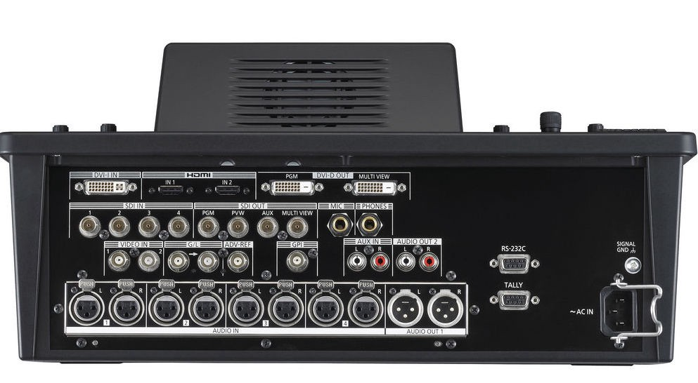
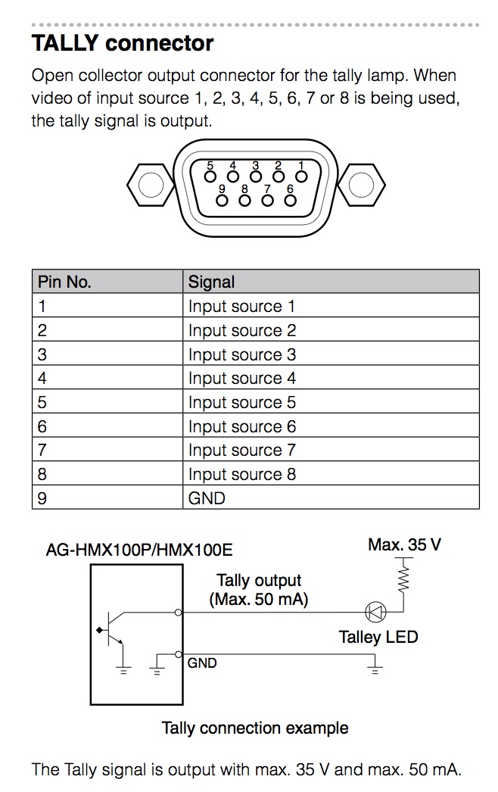
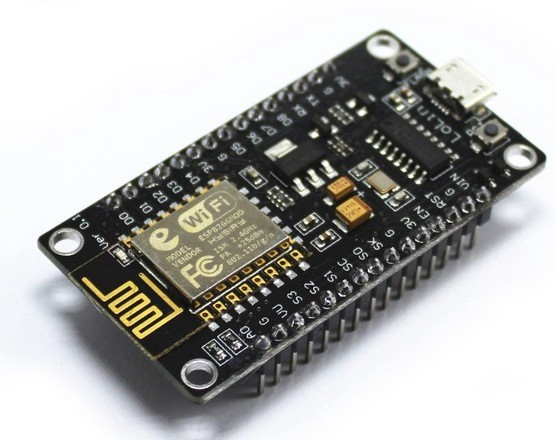
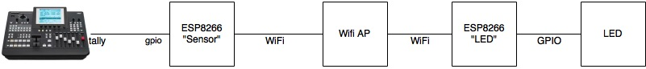

If you've seen programs about television studios, you know that cameras often have a little red light that indicates that that camera is live. That light can help the camera operator to know when to hold his camera steady, or the presenter to know in which direction to look. In the end, that tally receiver is just a remotely controlled LED. How difficult can it be to create that myself?

Two years ago, when we started video production, we did quite a bit of research to select the right video-mixer. After talking to suppliers and experts, we chose the Panasonic AG-HMX100.

This has been the workhorse of our setup. It always works flawlessly. When unboxing things like this, one of the first things I like to look at is: what connections can I hook up to this new toy!

Do you see those things on the right that look like serial ports? Well one of them is, and it has great potential. We’ll not go in to that one for now. The other one says ‘tally’. Now I didn’t know this, but it turns out that in the AV-world, tally is what they call the little red light on the camera that lights up when that camera is live.

Our (semi pro) cameras do have these little lights, but they only light up when you record on the camera. There is no connector for it. So the alternative is to attach a separate little device to the camera, which connects either through wires or wireless to the mixer. But these devices are pretty expensive.

## The plan
So first of all: how does this ‘tally’ port on my mixer work exactly? What kind of signals does it send out? I got into the manual, and found the following in part 2, page 29:

While this is very brief, it does have all the information that we need. Each pin is an input source, and the mixer will connect that pin to ground when the source is live. Also we need to make sure that we run max 50mA through it.

The little schematic has the LED connected to the tally connector, but. I don’t want to run extra cables to my cameras. How do i get the trigger signal to the device? A very obvious solution would be WiFi. No cables needed, and the receiving equipment is very cheap. I had a couple of ESP8266 boards lying around from previous projects. These things cost less than 3 dollars on [Chinese webshops](https://a.aliexpress.com/_mPZ94ok)

These devices have WiFi on board, run on 3 or 5 volts and have plenty of gpio pins. You can connect them to your computer using a standard micro-USB cable to program them. Seems like a perfect fit for this project! I will need 4 of these things: 1 to receive the inputs from the mixer (We’ll call this the sensor), and one to drive the LED on each of our 3 cameras. The sensor can use a USB adaptor for power, running on 5 volts while the LED drivers run on 3 volts using 2 AA batteries.

So here’s the plan:

The ESP’s have a USB connector and can be programmed directly from the computer. There are two main development environments. The first one is Arduino. It seems to have a decent community and libraries for most standard things. I did a couple of tests. I noticed that even very simple programs take a long time to upload. I think there’s some kind of translation going on to make it work. It seemed to me that although Arduino is a familliar and stable environment, the native nodemcu/lua environment might work better.

There are not a lot of ways to upload code to nodemcu. Luatool is giving me weird errors. I settled on ESPlorer. This tool is not really intuitive. For instance, when I plug in my device and click ‘open’, ESPlorer will open the connection to the device, but before I can do anything, Ihave to click ‘Chip Info’ 2 or 3 times. After that, I get a prompt and I can enter commands in the bottom, or upload scripts from the left. On the right, you won’t see any files. You have to click ‘refresh’ first, it will do sort of an ls command and then list the files on the right. If you left-click a file, it will execute it. To delete, rename or do other stuff, you have to right-click it. Once you get to know the quirks, it’s pretty workable.

I’m so happy that ‘extra buttons on the left’ are coming soon. — esp8266.ru
Getting connected
To connect the ESP8266 to the WiFi, we can use the lua function wifi.sta.config. You give it a ssid and a password and BOOM connected. But what if we don’t like hard-coding wifi passwords? Well, there’s a module for that: the end-user config module. This basically sets up an accesspoint for the user to connect to. The user can then enter the ssid and password of the accesspoint they want to connect the device to.

Pretty configuration screen
In order to set this up, you need to have the enduser setup module enabled in your nodemcu firmware. I used nodemcu-build.com to build a custom firmware, and then esptool to load it into my devices. Now, we just need a couple of lines of code to run the setup.

I made a couple of additions from the standard examples you’ll find online:
The wifi settings weren’t saved across reboots. In line 5, I enable saving these settings.
If you start doing network things right after wifi is connected, you will fail, because the dhcp procedure hasn’t completed yet: You don’t have an IP yet!. Nodemcu provides a callback that is called when the device has received an IP. In line 6, I hook up my callback to be executed when the device is ready to do network-things.
A lua-LED
Before diving into a project like this, i always do some ‘technology-demonstrators’. I ask myself what kind of things I need to learn in order to complete this project. One of these things is: How do you run a LED from the ESP8266?
This sounds simple, and it is. Simply hook up the led to one of the output pins (for instance: D0), add a resistor and then to ground. I found a resistor of 200 ohms worked fine on 3 volts. For 5, you might want a bit higher value. Most examples I found on the web used a 1K resistor. Next, you need just 2 lines of code to make it work:

The first line sets the pin to be an output, the second one sets the value to high. Those two commands should cause your led to light up.
Signal input
The mixer has a connector that looks like a serial port. The official name for this connector is DB9. Again, chinese sites offer lots of these connectors for almost nothing. One problem I had was: how do I mount this connector to my circuitboard? I am always glad when I come across a problem that can be solved using a 3D printer. I am a proud owner of a XYZ DaVinci mini printer. It’s very basic but perfect for these kind of things!

One pretty DB9 bracket
Pullups
Now, we have to talk about the circuit here. The video mixer manual clearly stated that we can put up to 35 volts on the input pins, which will be connected to ground when the channel is live. That means a current will run. The maximum allowed current is 50mA. So we need to make sure (using a resistor) that the current is below 50mA. Before thinking about resistor values, I read up on the ESP8266 input capabilities. It turns out the chip has a resistor connected to the input voltage built in! This is called a pull-up resistor. If you configure the pin to use the pull-up resistor, the pin will be at input voltage. When you connect the pin to the ground, the built in resistor will allow a small current to run (well below 50mA), and the chip will detect the pin value to be 0. This sounds perfect for our application. We don’t need any additional components. The pullup resistor in the ESP8266 allows us to simply connect the pins of the db9 connector directly to the input pins of the chip.
To technology-test this, I connected one of the input pins to a small switch, which connects to ground when pressed. There are two ways we can read the input value from the lua script. The first option is to use the gpio.read function. Very simple: you give it a pin number and it returns gpio.HIGH or gpio.LOW. However, this is a one-time thing. So this means we would have to read out the pins in a loop every x milliseconds.
The slightly more complicated alternative is gpio.trig. This function allows us to define a callback when the input changes. You can configure it to fire on rising edges, falling edges, or both. For this application, I'm using both.
So putting all this knowledge together:

Using this to configure 8 different inputs on the ESP8266, I can simply connect the wires from the DB9 connector directly to the input pins.
Communication
So much for hardware, it’s time to talk protocol. I want to keep network usage to a minimum, and keep things simple. The protocol supports 8 channels which can each be active or not active. Multiple channels can be active at once. The network consists of 1 sensor node that broadcasts the state of all 8 channels, and 1 or more led nodes that are configured to a specific channel and light up the LED when that channel is active.
My simple tally protocol is UDP based. All packets have source and destination ports 5004. Every packet starts with a single command byte. So far, i have defined 4 commands:
Command 1: ping
This command is sent as a broadcast to determine which nodes are on the network. All nodes are expected to reply to the sender of the broadcast with a command 4.
Command 2: Activate
This command sets the state for each of the 8 channels. This is done by a single byte. Every bit represents a channel.
Command 4: Pong
This command is the response to Ping, and it reports the id of the node and the channel that it is configured to. The sensor node reports channel 255.
Why is there no command 3 you ask? I thought it would be cool if I could send multiple commands in one packet. So for instance ping (1) and activate (2) would be command 3. So far I haven’t used this though.
Let's do network things!
Let's explore the part of the nodemcu API that allows us to do UDP. Each node in the system needs to be able to listen for incoming UDP messages, and it needs to be able to respond to them. In addition, we'll need to broadcast some of the packets to the entire LAN. Let’s explore some of the udp possibilities:

This works pretty well. I wrote a couple of lines python to send messages to the ESP8266, and I saw them printed in the ESPlorer console.
Prototypes
With all of these technology-tests I had all the ingredients ready to complete the whole solution. To test the usability and performance of this system, I created a prototype sensor and led node. Let's call this the 'duct-tape version'. This allowed me to see if the wifi connectivity is good enough for this system, and how to best position the LED for the camera-operators.
On the left, the duct-tape led node. On the right, the sensor node with db9 connector.

If you think the left photo looks like bomb, you need to cut down on Netflix time.
To the future
After a succesful first test, I will need to add some features to make this a mature product that is usable on a regular basis with minimal support:
2 more LED nodes to have 3 total
Small cases to make the nodes look more professional
A multicolor LED so I can also use it as a status indicator
A custom end-user-setup page, which allows you to configure not only the WiFi settings, but also the channel
A reset button
So far, the ESP8266 and the NodeMCU firmware have surprised in their capabilities. This is a very small device with WiFi on board which runs on a wide voltage range, has all the input/output features that I can think of, and is ridiculously cheap! I’ve only scratched the surface of what this little chip can do. Be sure to stay tuned for my next technical adventure!
All the sourcecode I created on this project is here on github. This article was not sponsored by panasonic or anyone else.