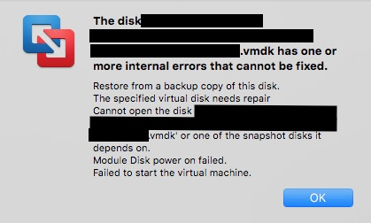
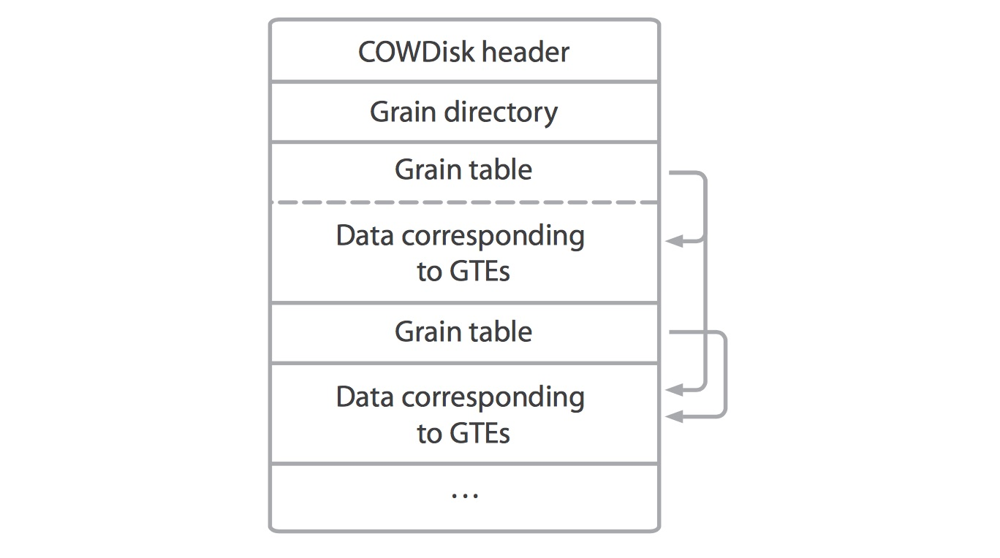
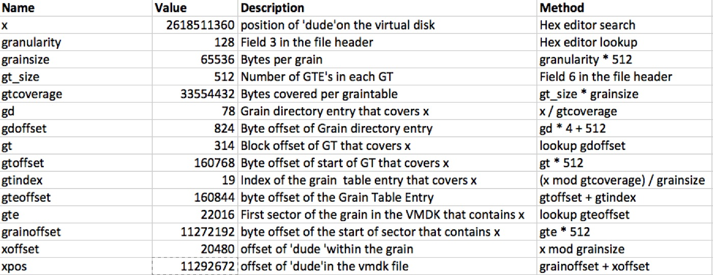
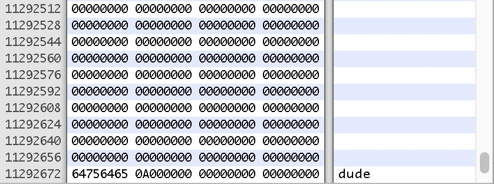
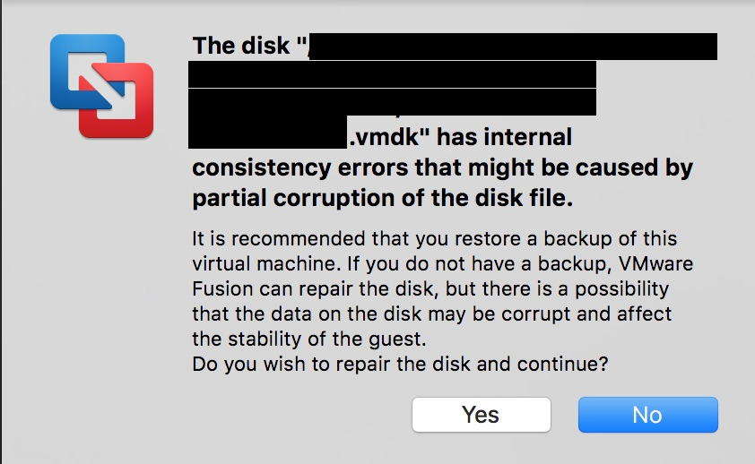
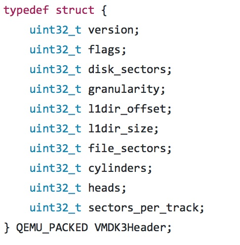
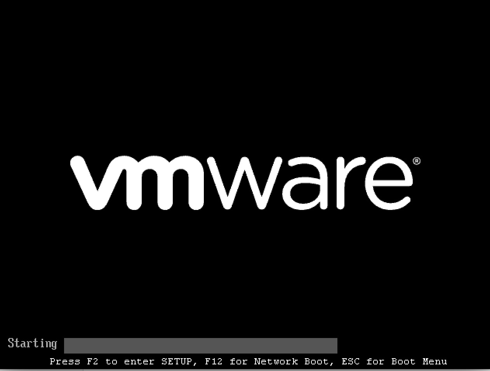

This week, the RAID-set for our VMWare machine crashed. Our sysadmin replaced the drives, rebuilt the set and restarted the VM’s. Not a problem for most VM’s, but one wouldn’t start, complaining about a corrupted disk. So i asked the sysadmin to copy the troublesome VM out to see what could be done. I dropped the .vmx file into VMWare Fusion and as expected I was confronted with a gruesome message:



This doesn’t really give any information about what is wrong with the file. Luckily, VMWare keeps a pretty detailed logfile. Looking in the logfile, i saw a whole bunch of lines like this:

```
2017–04–05T08:58:55.230+02:00| Worker#0| I125: DISKLIB-LEGCHK: The GTE [62] in GT [7522] is invalid (980705138)
```

Great! So all we need to do is find GTE 62 in GT 7522 and make it valid!

Couple of questions though… What's a GT? What's a GTE? What makes them invalid? Where do i find them? And what are these numbers? Byte offsets? Miles from the VMWare headquarters? If I want to get to the bottom of this, I need to know how VMDK's work.

Now before heading straight away to the googles, let's see what we already know about VMDK's. They're virtual disks, and they have a couple of features that are interesting. Thinking about these things allows us to make assumptions about the implementation of the software and helps to make it easier to understand the data.

## Let’s think like a VMWare engineer
First, the most common type of virtual disk is the one that starts out small and grows as you write data to it. An empty 500 Gig virtual drive takes up only megabytes. Now let's think like a VMWare engineer. The obvious way to build this is to **assume the entire disk is filled with zeroes**. Then, when something is written to the disk, you just write the new data somewhere in the VMDK file, and **map the written sectors in the file to the sectors in the virtual disk**. So you'll need some administration, some table to store this mapping.

Second, VMWare allows you to make snapshots of a VM. At a later time you can restore the VM to an earlier snapshot. The simplest way to create this is to make a full copy of the VMDK file. This would work but it takes up a lot of time and diskspace. A better way would be to make the **current VMDK readonly** and start a new VMDK next to it, again **only writing changes to the new file.** When you want to restore the snapshot, you just delete the new file, and make the old file writable again.

So these two points help interpret the current situation. The damaged VMDK was actually the 'top' layer of the virtual disk, containing only the newest data since the last snapshot (several months ago). The mysterious GT's and GTE's are probably part of the administration that is responsible for mapping sectors in the VMDK to sectors in the virtual drive.

It turns out that the VMDK format is pretty well documented. I found [this excellent document from VMWare](https://www.vmware.com/support/developer/vddk/vmdk_50_technote.pdf) documenting version 5, and also [this piece of qemu code](https://github.com/qemu/qemu/blob/master/block/vmdk.c) that implements VMDK versions 3 and 4. For sparse disks, the VMWare document describes both a workstation version (identified by the string 'KDMV'), and a datacenter version ('COWD'). Strangely enough, the qemu code seems to refer to the workstation version as 'VMDK4' and the datacenter version 'VMDK3'. For now I'll just assume that 'VMDK4' is the same as the workstation version, and 'VMDK3' is the same as the datacenter version. The differences between these two versions are mostly in the header.

The VMDK format uses **512 byte disk sectors**. The virtual disk is divided into blocks of sectors, these blocks are called '**grains**'. For every grain in the virtual disk, the VMDK keeps a 4 byte pointer to the sector where that grain is stored in the VMDK. If the pointer is 0, the grain is not in the VMDK. So it's either in a lower layer, or it's all zeroes (and not stored at all). These pointers are stored in '**Grain Tables**'

> GT stands for 'Grain Table', and GTE is Grain Table Entry

There are several Grain Tables in a VMDK, each table has a fixed size and describes a single contiguous block of grains on the virtual disk. To keep track of all these tables, the VMDK has a '**Grain Directory**'. This directory is located just after the file header, and **keeps pointers to all Grain Tables** in the file.



Armed with this knowledge, It's time to do some experimenting! I want to understand exactly how the mapping from a virtual disk sector to a sector in the VMDK file works. To do this, I spun up a simple ubuntu VM and created a textfile containing the word 'dude' and saved that in the home directory.

Then i shut down the machine. I should mention that since i used VMWare Fusion, the resulting VMDK is of the 'workstation' or 'VMDK4' format while the damaged VMDK was of the 'datacenter' or 'VMDK3' format. We'll come back to the difference between these two later. I used the VBoxManage command to convert the resulting sparse VMDK to a raw disk image:

```
VBoxManage clonehd — format RAW ubuntu.vmdk ubuntu.raw
```

I searched the raw disk for the word 'dude' to find out at which byte offset the file contents were written. I will call this byte offset 'x'. Then, using Excel, I worked out how to map this byte offset in the virtual disk to the byte offset in the VMDK. In short, this involves the following steps:

* First, find the start of the Grain Directory
* Then, find the entry of the Grain Directory that covers x
* Follow the pointer to the Grain Table
* Find the entry of the Grain Table that covers x
* Follow the pointer to the grain that contains x
* Calculate where in the grain is x



So, according to these calculations, at position 11292672 in the VMDK file, i should find the word 'dude'. Let's have a look.



Awesome! Now that I'm confident I understand the file format, let's take a step back and again look at the original error message to see if we can interpret it better.

```
2017–04–05T08:58:55.230+02:00| Worker#0| I125: DISKLIB-LEGCHK: The GTE [62] in GT [7522] is invalid (980705138)
```
 
So, Grain Directory entry 7522 points to a Grain Table that has a pointer in entry 62 which points to sector 980705138. This is invalid. It's easy to see why this is invalid. That sector number would translate to a byte offset within the VMDK file of about 450 GB, while the file is only 1 GB in size. So VMWare is complaining that this sector does not exist!

> After several hours of research, I understood the error message

Now that I know what the problem was, how could I fix it? The first step would be to find the Grain Directory and Grain Table entries that form a problem. I decided to write a small script that parses the Grain Directory and identifies problems. The script output looks like this:

```
[ 123] GDE 2:812
[ 415744] GTE 2,0:33188
[ 415748] GTE 2,1:33192
```

This can be interpreted as follows: At byte offset 123 is GDE number 2, and it points to sector 812. Sector 812 is byte offset 415744, this is where GT 2 starts. Entry 0 points to sector 33188, this is the first sector of the grain. Entry 1 of GT 2 is found 4 bytes further, and points to sector 33192. In this example, grains consist of 4 sectors (2048 bytes).

So what kind of problems are we looking for? First things i could think of were out of bounds pointers or sectors that are referenced by multiple pointers. Running this script against the VMDK, it identified the GTE's that were a problem.

```
[ 62986224] GTE 7509,2556:123044
[ 62986228] GTE 7509,2557:123045
[ 62986232] GTE 7509,2558:123046
[ 62986236] GTE 7509,2559:123047
[ 32136] GDE 7522:148328
[ 75943936] GTE 7522,0:33188
[ 75960320] ERROR Block 33188 already reserved by 3429,2372
[ 75943940] GTE 7522,1:519607
[ 75943944] GTE 7522,2:1427535157
[ 75943944] ERROR gte 1427535157 out of bounds
```

The numbers between the brackets are the byte offsets of each GDE or GTE, so i can easily go into the hex editor and alter these entries. The first troublemaker is the first entry of Grain Table 7522, which points to sector 33188. That sector was already pointed to by another Grain Table. A large part of Grain Table 7522 had problems. Looking at the data, I concluded that the pointer in Grain Directory Entry 7522 did not point to a real Grain Table. It pointed to some other data. So this pointer was clearly corrupted.

Either Grain Table 7522 is in the VMDK at some other position, or there never was a Grain Table in entry 7522. I couldn't think of a good way to tell which was the case, so I decided to take a guess an zero out the entry in the Grain Directory at byte offset 32136. After entry 7522, there were a couple of other GDE's and GTE's that I zeroed out. This is risky, because while I'm fixing the VMDK, I could be corrupting the filesystem.

After I did these edits, I fired up VMWare Fusion and hoped for the best. This popped up after a couple of seconds:



Well, at least VMWare offers a repair option now! Yes! Let's repair this sucker and go! I clicked the 'yes' button and waited. After a few seconds i got the same message. And then again. I noticed that the VMDK file was growing a couple of hundred MB's every time. Maybe it was consolidating the lower layers into the top one? I placed my phone on the return key and went to get some coffee.

When i got back, VMWare was still asking the same question, and the VMDK had grown to a whopping 650GB. I should mention that the original virtual disk was only 500GB. Something was obviously still wrong with it. I stopped VMWare and replaced the large file with my 'repaired' one. Back to the drawing board.

I looked in the vmware.log and found a new error waiting for me, just as mysterious as the last one:

```
DISKLIB-LEGCHK: Repairable hole of -2070752 sectors after the last block.
```

Yes, you're reading this correctly: **VMWare found a hole in my disk with a negative size**. What is going on here?

Remember when I wrote that my troubled VMWare image was of the 'datacenter' format? Let's have a look at the header structure of that format.



Now most of these fields map nicely to the 'VMDK4' header. One field that is only found in the VMDK3 header is 'file_sectors'. The VMWare document calls this field 'freeSector':

> **freeSector** is the next free data sector.It must be less than the length of the delta link.

The value of this field was '2008', so the 2008th sector was the first free one. This field was probably meant to quickly find an empty sector in the VMDK file to write to. I would expect new data to be written at the end of the file, but the file is way bigger than 2008 sectors. The error message is VMWare complaining that there are pointers in the Grain Directory that point after the next free sector. The fix for this is easy. The value of the next free sector should be : 2008 + 2070752 = 2072760. I hex-edited that in, restarted VMWare Fusion and BOOM:



The machine booted correctly!
The filesystem on the repaired volume mounted correctly, and I haven’t seen any signs of corruption. However, I have no way of knowing for sure that there are no corrupted files.

##So what have we learned today?
Well first of all, the correct, sane, logical, wise solution to this whole problem is to have a recent **backup.**. Hex-editing VMDK files is fun for sure, but it should never be necessary. If a VM is important enough to spend hours to fix, it is also important enough to have backups.

VMDK's are not as obscure as I thought. The **documentation** is pretty clear, and there are multiple open-source implementations that help interpreting the documentation (Real programmers read code to understand documentation, not the other way around.)

Programs often give very generic errors when something is wrong, and leave little or no opportunity to repair or diagnose the problem. Diving into the inner workings of the program and **thinking like the creator** of the program allows us to understand the problem and then hopefully fix it. This doesn't always work, but today I was lucky enough to find the right pieces to finish the puzzle.

The script I wrote to analyze the VMDK file can be found on [github](https://github.com/richmans/vmdkanalyzer). It is not documented, maintained or thoroughly tested, but maybe it helps someone.